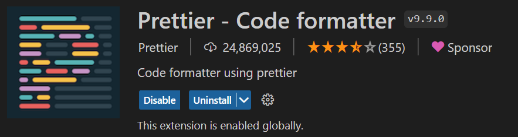

# Q&A之感

很久很久以前我就想学写前端了，但是一直没有动力，所以也一直没有去学。这次突然有了个推动动力就迫不及待地来学了捏~

在这次学习之前我一直以为前端能做的事情是很少的（可能主要是因为不知道JavaScript是什么东西吧），结果这次学了之后发现前端能写的东西还是很多很多滴！
之前一直在跟着学校老老实实地学C，其他的也没接触过，又感觉C用命令窗口交互自然是写不出什么看上去很有用的东西，所以感觉这一年也没学到什么太有用的东西，
结果突然接触到了前端就发现有这么多东西可以写，自然有好多好多东西想写了捏（现在想到的有麻将算番、第二语言词汇学习之类的，就是不知道靠不靠谱hhh）。

做这道题的过程中我也遇到了一些问题，属实折磨了我不少时间（虽然跟我之前参加的工高面试和超算暑期课相比算很少的了），结果这些问题最后都以一种非常令我想象不到的方式解决了。
比如我一开始写JavaScript的时候就用id找不着对应的元素，调了一个多小时，最后发现是因为js代码写到了我要找的元素的前面，放到后面就好了。
后来有一次用fixed模式设置放问题的
的位置（觉得用fixed可以适应不同大小的浏览器窗口），结果用JavaScript改它的位置的时候它的top属性就怎么找也找不着，调了一个多小时，
结果最后换了relative的方式设置位置就全好了。（感觉有点像我超算暑期课的时候调了一下午的代码后来发现是一个变量名里Y打成X了）

写这个文档的时候是周四晚上。从题目开放到现在除了这道题之外还干了很多事情捏。写了FDS的十页大作业报告，还在周末的时候赶了几乎整个第二周的作业
（第一周在忙超算暑期课的作业所以第二周一直在补第一周的作业hhh），感觉总共花在这道题的时间差不多能有七八个小时吧（尤其是那两个错误花了我四五个小时最后发现这个错误实在太sb...哈哈哈）
看看剩下的时间能不能再写一道题捏（虽然应该是不能了hhh）。

哦对了，这里附上一个装prettier的截图：
  
[]

那这道题的感想差不多就写到这里了呀！希望能进求是潮继续写代码捏！！！

哦对了，是不是还要加一点格式捏~

>求是潮是浙大最潮的学生组织，求是潮的办公室在小剧场B127
  
1. 我爱*求是潮*
1. 我爱浙大
  
- 我爱***求是潮***
- 我爱**浙大**
  
(我是分割线）
***
  
`printf("好想进求是潮捏");`
